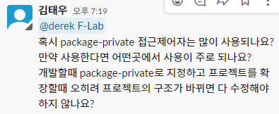
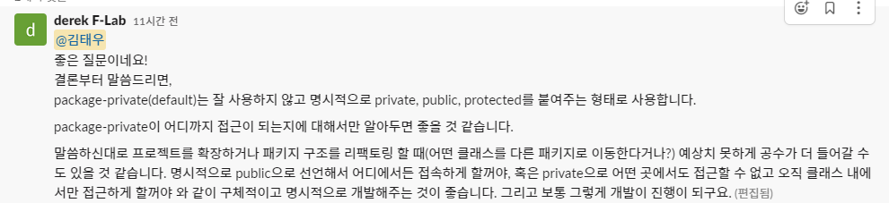

# 2022/10/14

## import를 이용하여 다른 패키지에 접근할때

import를 통해 패키지에 있는 모든 크래스를 가지고올때 *를 써도 괜찮지만 명시적으로 클래스를 나타내주는 습관이 좋다

static으로 선언된변수와 메소드를 사용할땐 import static을 사용하며 static 메소드나 변수가 
중복되는 상황에서는 자신의 클래스에 있는 static변수나 메소드를 우선하며 다음으로 import static으로 가져온
변수와 메소드를 사용한다.

## 접근 제어자

#### Public
- 누구나 어디서든 접근이 가능하다

#### protected
- 같은 패키지 내에 있거나 상속받은 경우에만 사용가능

#### package-private(default)
- 아무런 접근 제어자를 적어주지 않았을 때이며 같은 패키지 내에서만 접근이 가능하다.

#### private
- 클래스 내에서만 접근 가능

### 범위

public > protected > package-private > private

### package-private의 궁금점

### Feeling
접근제한자는 권한을 적게 줄수록 좋으므로 package-private을 사용하는 것이 좋아 보였다만
공부와 실제 현장에서 개발하는 갭차이가 있기에 단순 공부로는 부족함이 많은거 같다.

