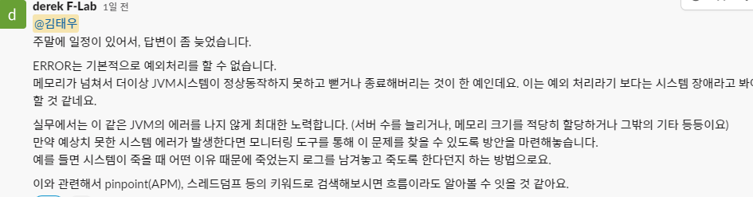

# 2022/10/18

## 자바 예외처리

### try-catch

예외를 처리하기 위한 구문

try {

예외발생할 가능성이 있는 문장

}catch(Exception e) {

보통 이곳에 예외메세지를 출력하고 로그로 남김.

}finally{

예외발생여부에 관계없이 상항 수행되어야 하는 문장

}

catch문 안에 System.out이 아니라 System.err로 넣어주는게 좋다.

일반적인 콘솔 화면에서는 별로 구분이 안가지만 IDE에서는 출력 결과가 다른 색으로 표시되기 때문에
System.err를 사용하는것을 생활하 하자.

### java.lang.Exception
모든 예외의 부모클래스

## 예외의 종류는 3가지

1. checked exception\
    - error와 runtime exception을 제외한 모든 예외
2. error
3. runtime exception or unchecked exception

### error
자바 프로그램 밖에서 발생한 예외
ex) 메인보드가 맛이갓거나 서버의 디스크가 고장 났다든지

Error와 Exception의 가장 큰 차이는 프로그램 안에서 발생했는지 밖에서 발생했는지의 차이
Error은 프로세스에 영향을 주고, Exception은 쓰레드에만 영향을 준다.

### runtime exception
예외가 발생할 것을 미리 감지하지 못했을 때 발생
이 런타임 예외에 해당하는 모든 예외들은 RuntimeException을 확장한 예외
컴파일시에 체크를 하지 않기 때문에 unchecked exception라고도 부른다.

## 모든 예외의 할아버지는 java.lang.Thorwable 클래스

Exception과 Error의 공통 부모 클래스이며 Thowable 클래스를 상속받아 처리한다.

### 자주 사용하는 메소드

1. getMessage()
   - 예외메세지를 String 형태로 제공( 어떤예외가 발생되었는지를 확인할 때 유용하다.)
2. toString()
   - getMessage와 마찬가지로 String형태로 제공 받으며 다만 예외 클래스 이름도 같이 제공한다.
3. printStackTrace
   - 장점 : 가장 첫줄에는 예외 메세지를 출력하고 두번째 줄에서는 예외가 발생하게 된 메소드들의 호출관계를 출력해준다.
   - 단점 : 매우 자세한 메시지를 볼 수있지만 운영할 시스템에 이 메소드를 사용하면 엄청나게 많은 양의 로그가 쌓이기 때문에 필요한 곳에만 사용

### 자바의 예외 처리 전략

예외를 처리할 때에는 표준을 잡고 진행 
- catch문 내에서 어떻게 처리할지를 명시적으로 선언해 두어야만한다.
    - catch문에서 로그에 남기는 등의 작업을 하고 예외를 throw를 이용하여 던져 주어야 문제가 발생한 정확한 원일을 찾을수있다.

- 임의의 예외 클래스를 만들때
  1. 반드시 try-catch로 묶어줄 필요가 없을 경우 Exception 클래스를 확장한다.
  2. 일반적으로 실행시 예외를 처리할 수 있는 경우에는 RuntimeException 클래스를 확장하는것을 권장
- catch문 내에 아무것도 없다면 에러의 원인 파악이 어렵기 때문에 로그 처리와 같은 예외 처리를 해줘야한다.

## error의 예외처리를 하는 방법이 있나?

결론적으론 Error의 예외처리는 기본적으로 할 수 없다는 이야기를 들었고 예외를 처리한다기 보단
시스템 장애라고 봐야한다.