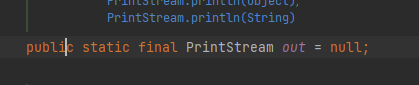
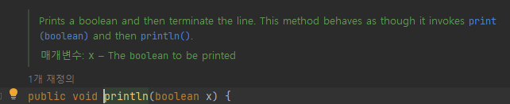
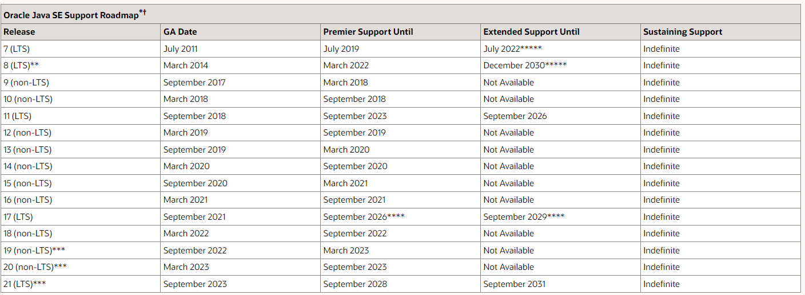

# 2022/10/22

### 1. System.out.println()이 static 메서드인지 아닌지 궁금할 때 어떻게 확인해봐야할까?

out은 static메서드고 println은 인스턴스 메소드이다.

### 인텔리제이 기준

window : control + b

MacOs : command + b

## JDK 8, 11, 17을 선택해야 하는 이유? 

자바의 여러가지 버전이 있지만 JDK 8 11 17을 중 대부분 사용한다 가장 큰 이유는 LTS가 지원하기 때문이다.

### LTS(Long Term Support)
- 장기 지원 버전이며 일반적인 경우보다 장기간에 걸쳐 지원하도록 특별히 고안된 소프트웨어의 버전

지금 시점에서 가장 많이 쓰이고 있는 버전은 아직까지 java8버전이며 자바 11버전 부터는 32비트
윈도우 운영체제를 지원하지 않습니다.

LTS기간도 8 > 17 > 11 순으로 길기 때문에 8버전 또는 17버전을 사용하는게 좋아보인다.