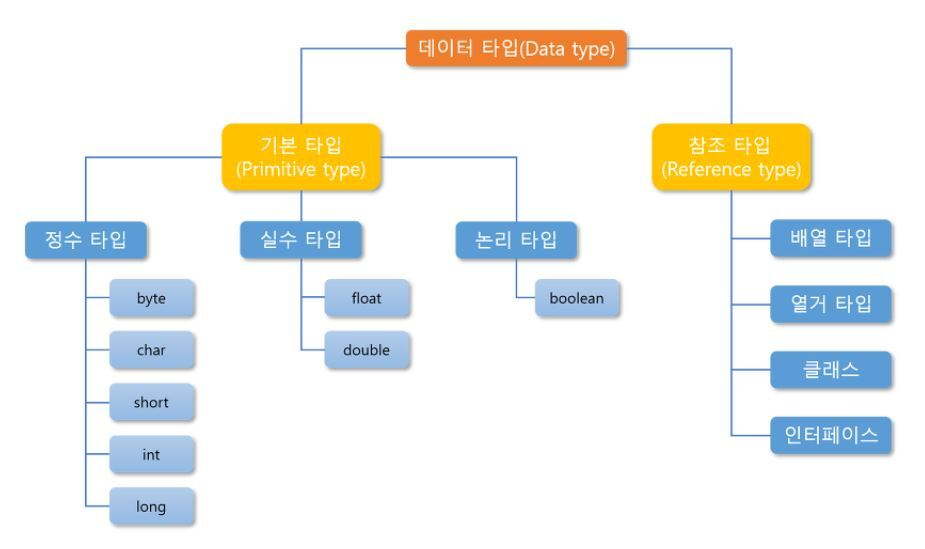

# 2022/10/30

## Primitive Type (기본형 타입)과 reference type(참조형 타입) 차이?

### Stack (정적 메모리) - primitive type 할당
Stack 영역에는 기본타입 변수가 할당 변수의 실제 값들이 저장

참조타입 변수들은 이 Stack 영역에서 Heap 영역에 생성된 객체의 주소 값을 저장한다.

객체 안의 메소드의 작업이 종료되면 할당되었던 메모리 공간은 반환되어 비워진다.

### Heap 영역(동적 메모리) - reference type 할당
Heap 영역에는 객체와 배열이 생성된다.
프로그램 실행시 메모리에 동적으로 할당된다.
참조하는 변수가 없으면 java 의 Garbage Collector 가 제거한다.

### 차이
가장 큰 차이라 생각하면 GC(Garbage Collection)이 동적하냐 안하냐의 차이라고 생각한다.
stack 영영에 할당된 기본타입 변수는 작업이 완전히 종료되어야지만 메모리 공간이 반환되지만
heap 영역에 할당된 참조타입은 GC에 의해 관리되는 차이가 존재한다.
