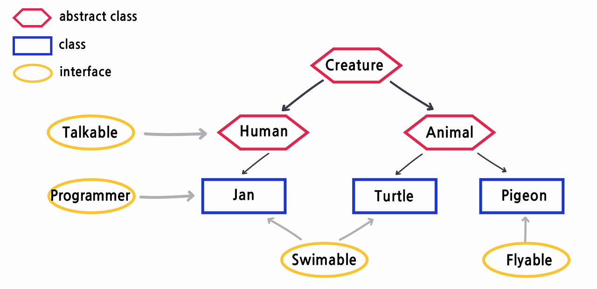

# 2022/11/1

### interface

- 모든 메소드가 추상 메소드
- 상수와 추상 메소드의 집합
- 생성자를 가지지 않는다.

### abstract class
- 추상 메소드가 하나라도 포함되거나 abstract로 선언한 경우
  - 추상 메소드를 가지지 않아도 괜찮다.
  - 추상 메소드가 하나라도 있다면 추상클래스로 되어야 한다.
- 일반적인 상속과 특성과 동일

### 공통점
1. 상속받은 클래스 혹은 구현하는 인터페이스 안에 있는 추상 메소드를 구현하도록 강제한다.
2. 객체를 생성할 수 없으며 상속받은 자식만이 객체를 생성 가능

### 차이점
1. 추상 클래스는 extends 예약어를 사용하여 상속하며 다중 상속이 불가능
   1. 인터페이스는 implements 예약어를 사용하여 상속하고 다중 상속이 가능
2. 추상 클래스는 변수, 생성자, 메서드 추상, 메서드를 가질 수 있지만 인터페이스는 상수와 추상 메서드만 가질 수있다.