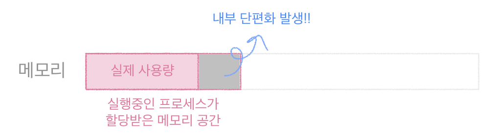

# 2022/11/10

## 메모리 단편화

>  메모리의 공간이 작은 조각으로 나뉘어져 사용가능한 메모리가 충분히 존재하지만 할당이 불가능한 상태를 메모리 단편화라고 한다.

## 외부 단편화

- 메모리가 할당되고 해제되는 작업이 반복될 때 작은 메모리가 중간중간 존재하게 된다. 
  - 이 때 중간중간에 생긴 사용하지 않는 메모리가 많이 존재해서 총 메모리 공간은 충분하지만 실제로 할당할 수 없는 상황이다.

계속해서 빈 메모리가 쌓이는데  마땅한 공간은 없지만 전체적으로 메모리 여유는 있을 때 외부단편화가 생겼다고 한다.

ex) 동적 메모리 할당 해제를 자주 하는 경우 - GC(가비지 컬렉션)

## 내부 단편화

>프로세스가 필요한 양보다 더 큰 메모리가 할당되어서 프로세스에서 사용하는 메모리 공간이 낭비 되는 상황