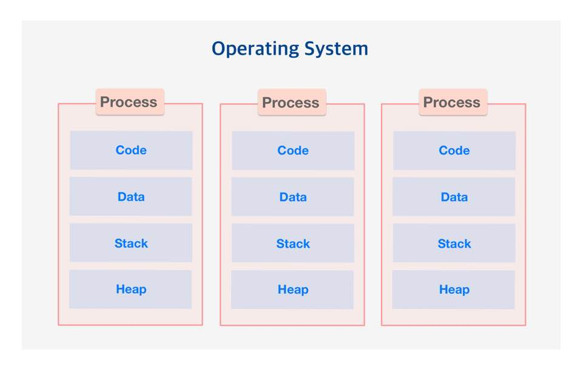
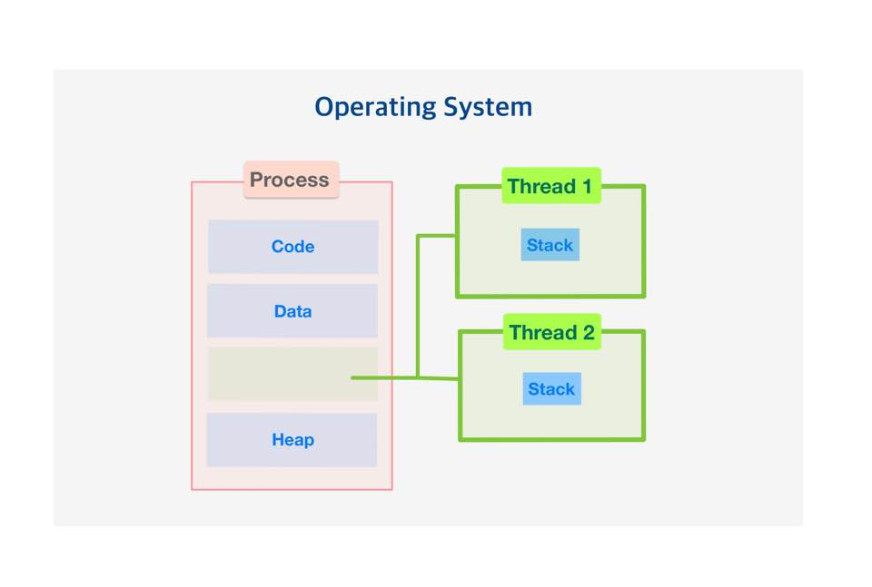

# 2022/11/11

## 프로그램(Program)

- 어떤 작업을 하기 위해 해야할 일들을 순서대로 나열한 것
- 컴퓨터에서 어떤 작업을 위해 실행할 수 있는 '정적인 상태'의 파일

EX) exe파일

## 프로세스(Process)

- 운영체제가 메모리 등의 필요한 자원을 할당해준 실행중인 프로그램
- 프로그램을 실행하면 운영체제로부터 실행에 필요한 자원을 할당받아 '프로세스'가 되는 것

EX)
1. cpu시간
2. 운영되기 위해 필요한 주소 공간
3. 독립된 메모리 영역(Code, Data, Stack, Heap)

### 프로세스 구조

- Code, Data, Stack, Heap의 구조로 되어있는 독립된 메모리 영역을 할당
- 각 프로세스는 별도의 주소 공간에서 실행
- 서로 독자적인 메모리 공간을 갖기 때문에 서로 메모리 공간을 공유할 수 없다.
- 다른 프로세스의 자원에 접근하려면 프로세스간의 통신(IPC)을 사용해야한다.
- 최소 하나 이상의 스레드를 포함

##  쓰레드(Thread)

> 프로세스가 할당 받은 자원을 이용하는 실행 단위이자, 프로세스의 특정한 수행 경로이자 프로세스 내에서 실행되는 여러 흐름의 단위

- 독자적인 스택(Stack) 메모리를 갖는다.
- 프로세스 내에서 각각 스택만 할당받고 Code, Data, Heap 영역은 공유
- 프로세스 내의 주소공간이나 자원들을 같은 프로세스 내의 스레드끼리 공유하며 실행
- 별도의 레지스터와 스택을 갖고 있지만, 힙 메모리는 서로 읽고 쓸 수 있다.
- 한 스레드가 프로세스 자원을 변경하면, 다른 이웃 스레드(sibling thread)도 그 변경 결과를 즉시 볼 수 있다.
- 메모리를 공유하기 때문에 동기화, 데드락 등의 문제가 발생 할 수 있다.

## 프로세스와 스레드

> 프로세스는 스레드를 담고있는 컨테이너, 스레드의 정보를 담고 있는 것

| 차이점   |프로세스|스레드|
|-------|---|---|
| 정의    |실행중인 프로그램|프로세스의 실행단위|
| 생성    |종료시간|많이필요|적게필요|
| 상호작용  |IPC 사용|공유 메모리 사용|
| 자원 소모 |많음|적음|
| 독립성   |각각 독립적|스택만 독립적이고 나머진 공유|