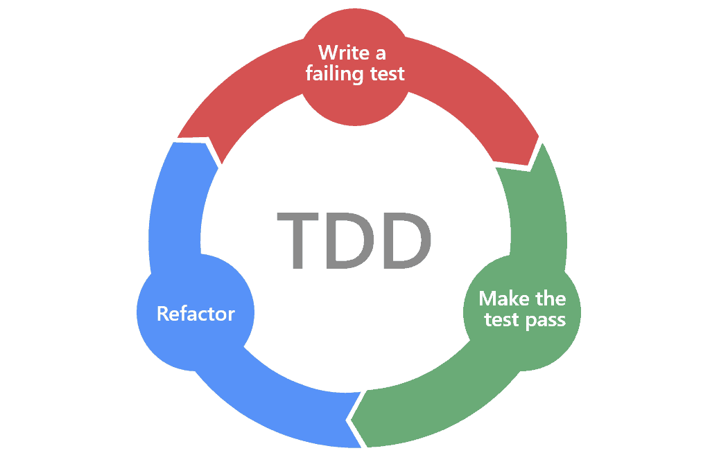
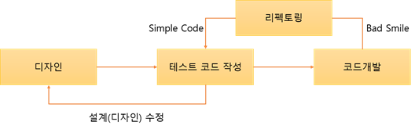

# 2022/11/12

##  테스트 코드를 작성해야 하는 이유?

- 빨간색 : 실패하는 테스트 코드를 먼저 작성
- 초록색 : 테스트 코드를 성공시키기 위한 실제 코드 작성
- 파란색 : 중복 코드 제거, 일반화 등의 리팩토링을 수행

1. 테스트 코드를 작성할 때까지 실제 코드를 작성하지 않는 것
2. 실패하는 테스트를 통과할 정도의 최소 실제 코드를 작성하는 것

> 이를 통해서 실제 코드에 대해 기대되는 바를 보다 명확하게 정의 함으로써 불필요한 설계를 피할 수 있다.

## TDD 

> 일반적인 개발 방식과 가장 큰 차이는 테스트 코드를 작성한 뒤에 실제 코드를 작성한다.

## 장점

1. 보다 튼튼한 객체 지향적인 코드 생성

2. 재설계 시간의 단축

3. 디버깅 시간의 단축

4. 테스트 문서의 대체 가능

5. 추가 구현이 용의하다.

# 단점

- 생산성 저하

