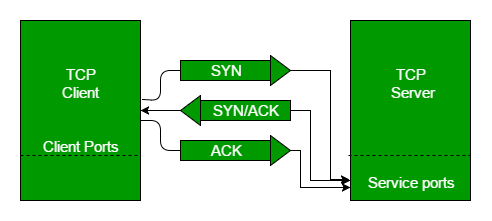

# 2022/11/21

##  3-Way Handshake

> 3-Way Handshake 는 TCP의 접속,4-Way Handshake는 TCP의 접속 해제 과정

### 3-Way Handshake 개념

- TCP 통신을 이용하여 데이터를 전송하기 위해 네트워크 연결을 설정(Connection Establish) 하는 과정
- 양쪽 모두 데이터를 전송할 준비가 되었다는 것을 보장하고, 실제로 데이터 전달이 시작하기 전에 한 쪽이 다른 쪽이 준비되었다는 것을 알 수 있도록 한다.
- 즉, TCP/IP 프로토콜을 이용해서 통신을 하는 응용 프로그램이 데이터를 전송하기 전에 먼저 정확한 전송을 보장하기 위해 상대방 컴퓨터와 사전에 세션을 수립하는 과정을 의미한다.

TCP 통신은 PAR (Positive Acknowledgement with Re-transmission) 을 통해 신뢰적인 통신을 제공

### 3-Way Handshake 과정

SYN(Synchronization) : 연결요청, 세션을 설정하는데 사용되며 초기에 시퀀스 번호를 보냄

ACK(Acknowledgement) : 보낸 시퀀스 번호에 TCP 계층에서의 길이 또는 양을 더한 것과 같은 값을 ACK에 포함하여 전송

1. Client -> Server (SYN)
- 클라이언트는 연결하고자하는 서버에 SYN을 보낸다. (seq : m)
    - 클라이언트가 데이터를 전송할 떄 Sequence Number를 임의의 랜덤 숫자로 지정하고, SYN 플래그 비트를 1로 설정한 세그먼트를 전송

2. Server -> Client (SYN+ACK)
- 서버는 SYN(m)을 받고, 클라이언트로 받았다는 신호를 보내기위해 ACK와 SYN를 전송한다.
   (seq : n, ACK : m+1)
   - ACK는 받은 seq의 +1로 지정하고 SYN과 ACK 플래그 비트를 1로 설정한 세그먼트를 전송한다.

3. Client -> Server (ACK) 
- 클라이언트는 SYN(n)과 ACK(m+1)을 받고 서버에 (ACK : n+1)을 전송한다.
   - 마지막으로 접속 요청을 받고 확인을 보내 연결을 맺음