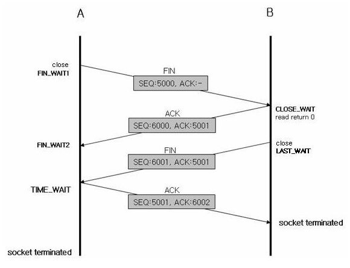

# 2022/11/22

## 4-way Handshake

1) 클라이언트에서 서버와의 연결 종료를 위해 서버에 FIN 패킷을 보내고 FIN_WAIT1 상태가 됩니다.
   1) (반대로 서버에서 먼저 끊을 수 도 있습니다.)

2) 서버는 클라이언트로부터 FIN을 받고 응답 패킷 ACK을 보냅니다.
   1) 상태는 CLOSE_WAIT가 됩니다

3) 서버가 통신이 끝나면, 즉 연결을 종료할 준비가 되면 클라이언트에게 FIN패킷을 보내고 LAST_WAIT 상태가 됩니다

4) 클라이언트는 확인 패킷 ACK을 보내고 TIME_WAIT 상태가 됩니다.

- FIN_WAIT1 :	Close 를 호출한 측의 소켓이 진입하는 상태, FIN 보냄
- CLOSE_WAIT :	Close를 받으면 CLOSE_WAIT 상태로 진입함, Ack 보냄
- FIN_WAIT2 :	Ack 신호를 받은 소켓은  FIN_WAIT1 > FIN_WAIT2로 상태 변경됨
- LAST_WAIT :	Close 호출 후 진입하는 상태, FIN 보냄
- TIME_WAIT	:  Close 받으면 진입하는 상태, ACK 보냄
- CLOSED  :	연결 종료