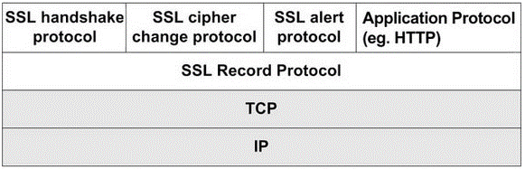

# 2022/11/25

## SSL

>SSL(Secure Socket Layer) Protocol은 NetScape사에서 웹서버와 웹 브라우저 사이의 보안을 강화화기 위하여 만들었다. SSL은 Certificate Authority(CA)라 불리는 인증기관으로부터 서버와 클라이언트의 인증을 하는데 사용된다. SSL은 대칭키와 공개키의 장점을 이용한 통합 암호화 방식이다.

## SSL 구조

Application 계층에서 사용되는 HTTP 프로토콜에 SSL 프로토콜이 덧 붙은 것

## SSL 암호화

### 대칭 키
> 암복호화에 사용하는 키가 동일한 암호화 방식을 말한다.

- 공개키 암호화 방식에 비해 속도가 빠르다
- 키를 교환해야한다는 문제가 발생(키 배송 문제)
  - 키 교환도중 키가 탈취될 수 있는 문제도 있다.
  - 사람이 증가할수록 따로따로 키교환을 해야하기 때문에 고나리해야 할 키가 방대하게 많아질 수도있다.

### 해결법
키의 사전 공유에 의한 해결, 키 배포센터에 의한 해결, Diffie-Hellman 키 교환에 의한 해결, 공개키 암호에 의한 해

### 공개 키
> 암복호화에 사용하는 키가 서로 다르며 따라서 비대칭키 암호화라고도 한다. 
> 송수신자 모두 한쌍의 키(개인키, 공개키)를 갖고있게 된다.

- 

