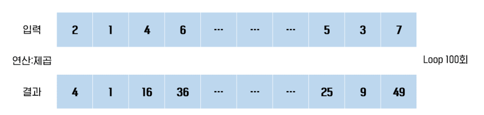
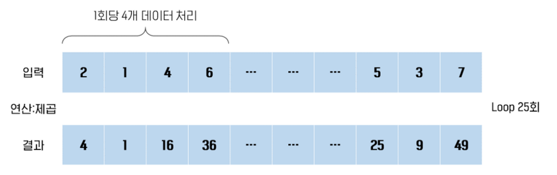
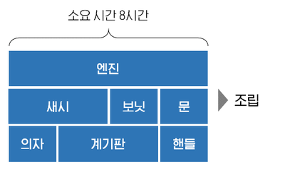

# 2022/11/28

## 병렬성
>병렬성은 실제로 동시에 동작하는 것을 말합니다. 

- 멀티 코어 환경에서 동작합니다. 
- 멀티스레드가 병렬 처리된다는 것은 보장할 수 없습니다. 
  - OS의 스케줄러가 결정하기 때문입니다. 

데이터 병렬성과 작업 병렬성으로 나뉜다.

### 데이터 병렬 처리

> 배열에 들어 있는 연속적인 100개의 데이터를 처리해야 한다면 루프를 100번 돌아야 하지만, 
1회당 4개의 데이터를 병렬처리할 수 있다면 루프를 25번 돌면 됩니다. 

### 작업 병렬성

>작업 병렬 처리는 여러가지 task를 병렬적으로 처리하는 것을 말한다.

### 참조
https://medium.com/naver-cloud-platform/%EC%9E%AC%EB%AF%B8%EB%A1%9C-%EC%9D%BD%EC%96%B4%EB%B3%B4%EB%8A%94-%EB%B3%91%EB%A0%AC%EC%B2%98%EB%A6%AC-c60c8e3b62a7