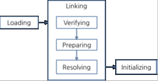

# 2022/11/5

## JVM 구조

- Source Code : 원본 코드, 사람이 작성한 코드
- Class Loader : Class 파일을 불러와서 메모리에 저장
- Execution Engine : Class Loader에 저장된 Byte Code를 명령어 단위로 분류하여 하나씩 실행하게 하는 엔진
- Runtime Data Area (Memory Area) :  JVM이 프로그램을 수행하기위해 운영체제로부터 할당받은 메모리 공간

## Memory Area 규조

1) Method Area
   - JVM이 실행되면 생기는 공간
   - Class 정보, 전역변수 정보, static 변수 정보가 저장
   - Runtime Constant Pool 상수가 저장되는 공간
   - 모든스레드에 정보가 공유
2) Heap
   - new로 생성된 객체, Array와 같은 동적으로 생성된 데이터가 저장되는 공간
   - GC가 동작하여 메모리 관리
   - Reference Type의 데이터가 저장되는 공간
3) Stack
   - 지역변수 메소그의 매개변수와 같이 잠깐 사용하고 필용 ㅓㅄ어지는 데이터가 저장되는공간
   - LIFO
   - 지역변수지만 Reference Type일 경우 Heap에 저장된 데이터의 주소값을 Stack에 저장해서 사용
   - 스레드마다 하나씩 존재
4) PC Register
   - 쓰레드가 시작될때 생성
   - 생성될 때마다 생성되는 공간으로 쓰레드마다 하나씩 존재
   - 쓰레드가 어떤 부분을 무슨 명령으로 실행해야하는지 기록을 하는 부분
   - 현재 수행중인 JVM 명령의 주소를 갖는다.
5) Native Method Stack
   - 자바 외 언어로 작성된 네이티브 코드를 위한 메모리 영역