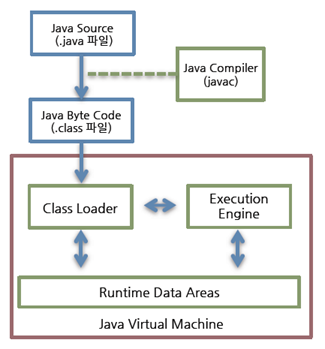
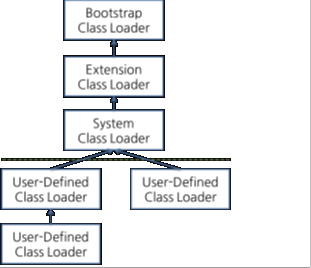
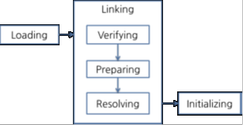

# 2022/11/7

## JVM 메모리 구조

> 클래스 로더가 컴파일된 자바 바이트코드를 런타임 데이터 영역에 로드하고 실행 엔진이 자바 바이트 코르를 실행한다.

## Class Loader

> 자바는 컴파일타임이 아니라 런타임에 클래스를 처음으로 참조할 때 해당 클래스를 로드하고 힝크하는 특징

- 계층 구조 : 클래스 로더끼리 부모-자식 관계를 이루어 계층 구조로 생성
  - 최상위 클래스 로더는 부트스트랩 클래스 로더
- 위임 모델 : 계층 구졸르 바탕으로 클래스 로더끼리 로드를 위임하는 구조로 동작
  - 클래스를 로드할 때 먼저 상위 클래스 로더를 확인하여 상위 클래스 로더에 있다면 해당 클래스를 사용
    - 상위 클래스 로더가 없다면 로드를 요청받은 클래스 로더가 클래스를 로드한다.
- 가시성 제한 : 하위 클래스 로더는 상위 클래스 로더의 클래스를 찾을 수 있다. 하지만 상위 클래스 로더는 하위 클래스 로더의 클래스를 찾을 수 없다.
- 언로드 불가 : 클래스 로더는 클래스를 로드할 수 있지만 언로드 불가.
  - 하지만 언로드 대신 현재 클래스 로더를 삭제하고 아에 새로운 클래스 로더를 생성하는 방법을 사용

- 각 클래스 로더는 로드된 클래스들을 보관하는 네임스페이스를 갖는다.
   - 클래스를 로드할 때 이미 로드된 클래스인지확인하기 위해서 네임스페이스에 보관된 FQCN을 기준으로 클래스를 찾는다.
      - FQCN이 갖더라도 네임스페이스가 다르면 다른 클래스 로더가 로드한 클래스이면 다른 클래스로 간주한다.

> 클래스 로더가 클래스 로드를 요청 받으면 클래스 로더 캐시, 상위 클래스 로더, 자기 자신의 순서로
> 해당 클래스가 있는지 확인
> 
> 거슬러 올라가며 확인하는데 부트스트랩 클래스 로더까지 확인ㅎ도 없으면 요청 받은 콜래스 
> 로더가 파일 시스템에서 해당 클래슬르 찾는다.

- 부트스트랩 클래스 로더 : JVM을 기동할 때 생성, Object 클래스들을 비롯하여 자바 API들을 로드
  - 네이티브 코드로 구현되어 있다.
- 익스텐션 클래스 로더 : 기본 자바 API를 제외한 확장 클래스들을 로드
  - 다양한 보안 확장 기능 등을 여기서 로드
- 시스템 클래스 로더 : 시스템 클래스 로더는 애플리케이션의 클래스들을 로드
  - 사용자가 지정한 $CLASSPATH 내의 클래스들을 로드
- 사용자 정의 클래스 로더 : 애플리케이션 사용자가 직접 코드 상에서 사용해서 사용하는 클래스 로더

> 부트스트랩 클래스 로더와 익스텐션 클래스 로더는 JVM자체의 구성 요소들을 로드한 것이라 할 수 있다.

웹 애플리케이션 서버와 같은 컨테이너는 웹 애플리케이션과 엔터프라이즈 애플레키이션이 서로 독립적으로 작동하도록
사용자 정의 클래스 로더를 사용
- 클래스 로더의 위임 모델을 통해 애플리케이션의 독립성을 보장

< 클래스 로드 단계 >

- 로딩 : 클래스 파일에서 가져와 JVM의 메모리에 로드
- 검증 : 읽어 들인 클래스가 자바언어 명세 및 JVM명세에 명시도니 대로 잘 구성됐는지 검사 
  - 가장 까다롭게 검사하며 가장 복잡하고 시간이 많이 걸린다.
- 준비 : 클래스가 필요로 하는 메모리를 할당, 클래스에서 정의된 필드, 메서드, 인터페이스를 나타내는 데이터 구조를 준비
- 분석 : 상수 풀 내 모든 심벌릭 레퍼런스를 다이렉트 레퍼렌스로 변경
- 초기화 : 클래스 변수를 적절한 값으로 초기화
  - static initializer 실행하고, static 필드를 설정도니 값으로 초기화
> JVM 명세는 이 작업에 대해 명시하고 있으나 작업에 따라서 실행 시점은 유연하게 적용 가능