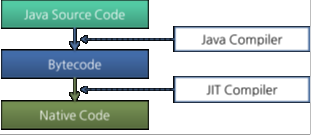
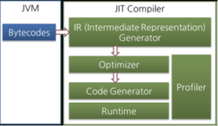

# 2022/11/8

## JIT 컴파일러

### 인터프리터
> 바이트코드 명령어를 하나씩 읽어서 해석하고 실행
> 하나씩 해석하고 실행하기 때문에 바이트코드 하나하나의 해석은 빠른 대신 인터프리팅 결과의 실행은 느리다.
> 
> 바이트 코느라는 언어는 기본적으로 인터프리터 방식으로 작동

### JIT 컴파일러

> 인터프리터의 단점을 보안하기 위해 도입된 것

1. 인터프리터 방식으로 실행하다가 적절한 시점에 바이트코드전체를 컴파일해 네이티브 코드로 변경
2. 해당 메서드를 더 이상 인터프리팅하지 않고 네이티브 코드로 직접 실해아하는 방식
3. 네이티브 코드를 실행하는것이 하나씩 인터프리팅하는 것보다 빠르다.
4. 네이트브 코드는 캐시에 보관하기 떄문에 한 번 컴파일된 코드는 계속 빠르게 실행 가능

JIT 컴파일러가 컴파일하는 과정은 바이트코드를 하나씩 인터프리팅하는 것보다오래 걸리므로 한 번만
실행되는 코드라면 컴파일하지 않고 인터프리팅하는 것이 유리
- JIT 컴파일러를 사용하는 JVM은 내부적으로 해당 메서드가 얼마나자주 실행되는지 확인하고 일정 정도를 넘을 때만 컴파일을 실행

### JIT 컴파일러 동작

>바이트코드를 일단 중간 단계인 IR로 변환해 최적화하고 그 다음에 네이티브 코드를 생성