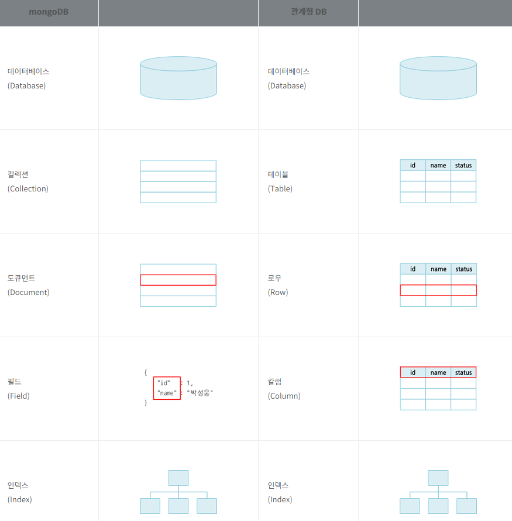

# 2022/12/10

## Mongo DB
> NoSQL 데이터베이스의 한 종류인 도큐먼트 데이터베이스

## 1.1 특징

1. 도큐먼트 데이터베이스
   1. 도큐먼트는 HTML과 같은 특정 형식의 태그 구조를 의미
   2.  mongoDB는 JSON 형식으로 데이터를 관리
   3. 데이터 입출력 시에는 JSON 형식의 도큐먼트를 사용하나 데이터베이스 저장 시에는 이진 포맷으로 인코딩한 BSON(Binary JSON) 형식의 도큐먼트로 변환되어 저장
   4. 도큐먼트는 필드와 값의 쌍으로 구성되며, 관계를 갖는 데이터를 중첩 도큐먼트와 배열을 사용하여 1개의 도큐먼트로 표현

2. 유연한 스키마
   1. 스키마의 선언 없이 필드의 추가와 삭제가 자유로운 Schema-less 구조
   2. mongoDB는 컬렉션 내 모든 도큐먼트들의 필드 집합이 동일하지 않고 같은 필드라도 데이터 타입이 다를 수 있는 비정형 스키마입니다.

3. 비 관계형 데이터베이스
   1. 관계형 데이터베이스의 관계 개념이 없는 비 관계형 데이터베이스
   2. 조인을 지원하지 않으며, 대신 임베디드 방식이나 레퍼런스 방식의 도큐먼트 구조를 사용한 후 애플리케이션에서 조인해야 한다.

4. 비 트랜잭션
   1. 트랜잭션을 지원하지 않고 각각의 도큐먼트 단위로 처리
   2. 트랜잭션을 지원하지 않으므로 Commit 또는 Rollback 개념이 없으며 모두 Auto Commit으로 처리

#
### 1.2 JSON 및 BSON

> 데이터를 관리하기 위한 형식으로 데이터 입출력 시에는 JSON 형식을 사용하고 데이터 저장 시에는 BSON 형식을 사용

BSON으로 인코딩하거나 디코딩하는 것은 mongoDB가 자동으로 처리 사용자가 몰라도 문제없다.
#
### 1.3 객체

#
### 1.4 데이터 조작(DML)

>몽고 DB의 DML은 SQL 문법을 사용하지 않고 자바스크립트 기반의 명령어와 JSON 도큐먼트를 인자로 사용하지만, 관계형 데이터베이스의 데이터 조작어와 형태만 다를 뿐 비슷한 역할을 수행

#
### 1.5 스키마

> 별도의 스키마 선언 없이 도큐먼트의 필드를 자유롭게 추가 및 삭제할 수 있는 유연한 구조로, 이는 관계형 데이터베이스와 구분되는 가장 큰 특징

#
### 데이터 모델

> mongoDB에서의 데이터 모델링은 크게 임베디드 방식과 레퍼런스 방식으로 나뉜다

