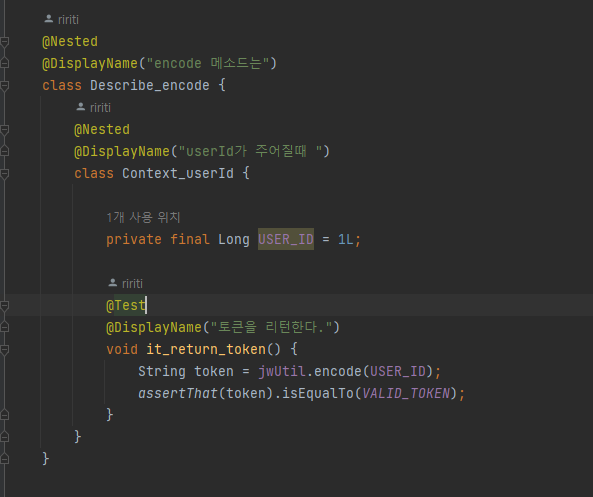

# 2022/12/13

## Describe - Context - It 패턴

> BDD 테스트 코드 작성 패턴

- 영어로 Context문을 작성할 때에는 반드시 with 또는 when으로 시작하도록 한다.
- It 구문은 It returns true, It responses 404와 같이 심플하게 설명할수록 좋다.

- 테스트 코드를 계층 구조로 만들어 준다.
- 테스트 코드를 추가하거나 읽을 때 스코프 범위만 신경쓰면 된다.
- "빠뜨린" 테스트 코드를 찾기 쉽다.
- 높은 테스트 커버리지가 필요한 경우 큰 도움이 된다.

## 예시

