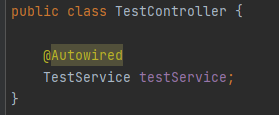
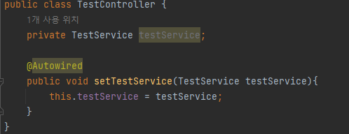
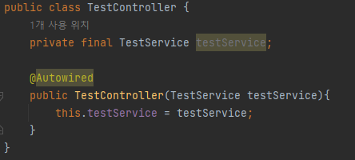

# 2022/12/18

## DI(의존성 주입)
> 각 객체 간 의존관계를 스프링 컨테이너가 개발자가 정의한 Bean 등록 정보를 바탕으로 자동으로 주입해주는 기능

일반적인 다양한 기존 스프링 프로젝트를 보면, Controller에서 Service나 Repository 객체를 사용 시, new 키워드를 통해 컨트롤러에서 
체를 직접 생성하여 사용하지 않고 의존성 주입을 통해 스프링 컨테이너에 생성된 객체를 받아 사용하고 있는 것을 볼 수 있습니다.

@Component, @Service, @Repository, @Controller 등의 어노테이션이 붙은 클래스들은 스프링 실행 시 
스캔을 통해 개발자가 정의한 의존성 정보를 자동으로 bean 설정 정보에 등록을 하게 되어 의존성 주입이 동작하게 합니다.

### 장점

- 객체간의 결합도를 낮춘다
- 코드의 양을 줄여준다
- 테스트를 용이하게 한여 개발 및 유지보수가 쉬워진다

### 종류

1. 필드 주입

> 가장 코드가 단순하고 기존에 많이 봐왔고 자주 사용했던 방식

#### 단점
- final 선언 불가
- DI 에서만 동작, 외부에서 수정 불가, 테스트의 어려움

#
2. 수정자 주입

> Setter를 기반으로 한 의존성 주입
> 
> 주입받는 객체가 변경될 가능성이 있는 경우에 사용하게 됩니다.

OCP 개방 폐쇄의 원칙을 위반하게 되어 변경의 가능정을 배제하고, 불변성을 보장하는 것이 좋다.

#
3. 생성자 주입

> 객체의 불변성(Immutable)을 확보할 수 있기 때문에 주입받을 필드를 final으로 선언 가능

- 컴파일 시점에 누락된 의존성을 확인할 수 있다
- 객체 생성 시점에 필수적으로 빈 객체 초기화를 수행해야 하기 때문에 NullPointerException을 방지가능