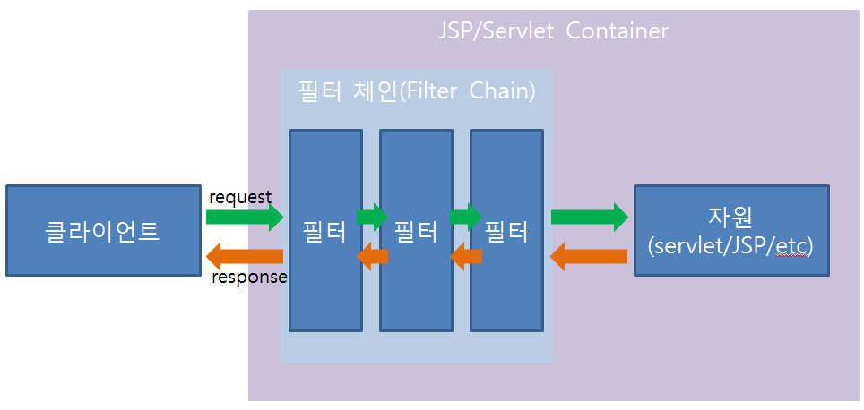

# 2022/12/19

## 서블릿 필터란?

> HTTP 요청과 응답을 변경할 수 있는 재사용 가능한 코드

- 자원이 받게되는 요청 정보는 클라이언트와 자원 사이에 존재하는 필터에 의해 변경된 요청정보
- 클라이언트가 받게되는 응답 정보는 필터에 의해 변경된 응답정보이다.
- 필터는 요청/응답 정보를 변경하는 역할 뿐 아니라 흐름을 변경하는 역할도 한다.

## 사용처
1. 사용자 인증
2. 권한 체크
3. 데이터를 로깅할때 사용

