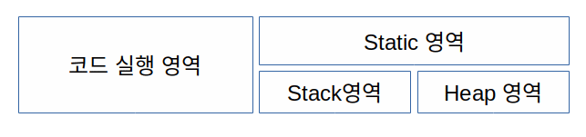

# 2022/12/02

스프링 입문을 위한 자바 객체 지향의 원리와 이해

## 2장

### 자바 프로그램의 개발과 구동

**JDK**
- 자바개발도구(JVM용 소프트웨어 개발 도구)
- 자사 소스 컴파일러인 javac.exe 가 포함

**JRE** 
- 자바 실행 환경(JVM용 OS)
- 자바 프로그램 실행기인 java.exe포함

**JVM** : 자바 가상 기계(가상의 컴퓨터)

## T메모리

>메모리는 크게 4가지 영역으로 나누고 데이터 저장 영역을 T메모리 구조라고 지칭

### 메서드 스택프레임

- 모든 자바 프로그램이 포함하게 되는 패키지인 java.lang 패키지는 static영역에 배치
- import 또한 static영역에 위치하게 된다.
- 프로그램 상의 모든 클래스들도 static영역에 위치

중괄호가 열렸을때 main() 메서드의 스택 프레임이 생겼다면 닫는 중괄호가 오면 스택 프레임이 소멸된다.

### 블록 스택 프레임

if 블록
- if-else 구문에서 참이 먼저 나오면 뒤에 있는 else는 스택 메모리에 등장도 못하고 사라진다.

### 지역 변수와 메모리

지역 변수 : 스택 영역에서 일생을 보낸다.

클래스 멤버 변수
- 스태틱 영역에서 일생을 보낸다
- JVM이 종료될때까지 고정된 상태로 자리를 지킨다.

객체 멤버 변수
- 힙에서 일생을 보내며
- 객체와 함께 가비지 컬렉터가 작동하여 메모리 정리한다.

