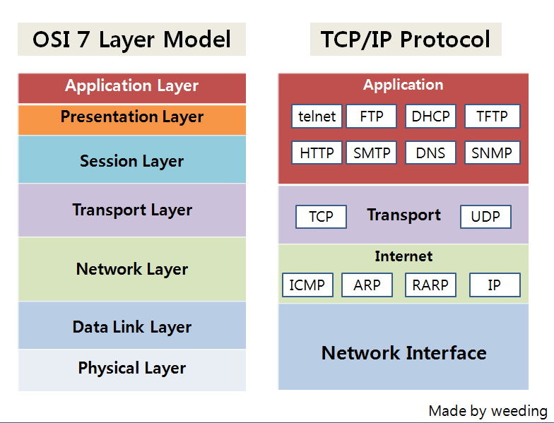

# 2022/12/23

## OSI 7계층

## 1. L1 물리계층(Physical Layer)

랜선이 랜카드와 연결이 되어 있고, 랜카드에서 이러한 전기 신호로 변환

### 특징
- 단지 데이터를 전달 및 받기만 함 (에러등은 신경X)

EX) Repeater, Hub, 케이블

**브로드캐스팅(Broadcasting)**

> 허브는 마치 공유기처럼 연결 포트가 여러 개로 되어있고 데이터가 들어오면 연결된 모든 노드(컴퓨터)에 뿌려주는데
> 이를 브로드캐스팅이라 함

## L2 데이터링크계층(Data Link Layer)

> 포인트 투 포인트(Point to Point)

물리 계층으로부터 데이터를 받아서 데이터를 신뢰 할 수 있게 전송하는 역할

### 특징

1. 오류 제어 흐름제어 수정

2. 서브 계층인 MAC과 LLC로 구성이 되어있고

3. 맥 주소를 가지고 통신

4. 전송 단위 : Frame

Ex) 브리치, 스위치

**MAC주소**
> 전자기기의 주민등록번호 같은 것이며 네트워크에 따라 변경되지 않는다

**Frame**

1. 하나의 네트워크 패킷을 담는 컨테이너

2. 데이터와 제어정보를 담고 있으며 데이터링크 계츠에서만 사용한다.

3. 동일 네트워크 안에서 노드 간의 발신지, 수신지의 주소 포함

## L3 네트워크 계층(Network Layer)

> 흔히 아는 IP주소를 제공하는 계층 , 대표적으로 노드들을 거칠때마다 라우팅 해주는 역할을 담당

### Routing(라우팅)

데이터를 목적지까지 가장 안전하고 빠르게 전달하는 기능
(노드와 노드 사이에 최적의 경로를 찾아줌)

## L4 전송계층(Transport Layer)
> 사용자들이 데이터를 주고 받을 수 있게 하는 계층

### 특징

1. TCP/UDP 프로토콜 사용

2. 데이터 단위 : Segment

3. 오류검출/복구/흐름제어/중복검사 (효율적인 데이터 전송 위해)

## L5 세션계층(Session Layer)
> 통신 장치 간의 상호작용 및 동기화를 제공하는 계층

### 하는일
- TCP/IP 세션을 만들고 없애는 역할
- 통신을 하기 위한 세션을 확립, 유지, 중단하는 역할
- 연결 세션에서 데이터 교환과 에러 발생 시 복구 관리

## L6 표현계층(Presentation Layer)

> 데이터를 어떻게 표현할지를 정하는 역할을 하는 계층

### 특징

1. 암복호화

2. 압축

3. 인코딩 디코딩

## L7 응용계층(Apllication Layer)

> 인터페이스 역할을 하는 계층

사용자로부터 정보를 입력받아 하위 계층으로 전달하고 하위 계층에서 전송한 데이터를 사용자에게 전달

### 특징

1. HTTP / FTP/ DNS 등

2. 단위 : data

3. 소켓 프로그래밍을 통해 송신 및 수신