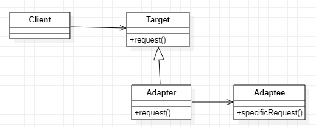
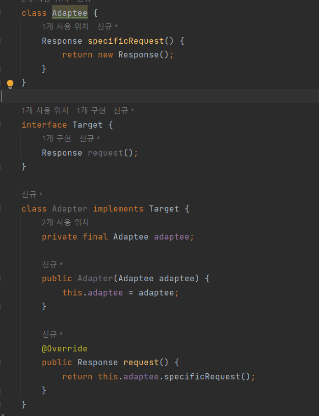
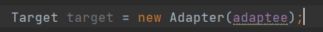

# 2022/12/24

# 디자인 패턴

> 실제 개발 현장에서 비즈니스 요구 사항을 프로그래밍으로 처리하면서 만들어진 다양한
> 해결책 중에서 많은 살마들이 인정한 베스트 프랙티스를 정리한 것

## 어댑터 패턴

- 호환성이 없는 기존 클래스의 인터페이스를 변환하여 사용자가 기대하는 인터페이스 형태로 변환시키는 패턴
- 코드의 재활용성을 증가하고 기존의 코드를 수정하지 않는 장점이 있음

클라이언트와 구현된 인터페이슬르 분리시켜 향후 인터페이스가 바뀌더라도 그 변경 내역은 어댑터에 캡슐화 되어
클라이언트는 바꿀 필요가 없어진다.

### 어댑터 패턴 다이어그램

- Client는 Target 인터페이스를 구현한 Adaptee가 필요하다.
- Adaptee는 Target인터페이스를 구현하지 않고 있다.
  - Adaptee는 이미 개발이 완료되어 사용중이다.
  - Adaptee를 변경하는 것이 적절하지 않은 상황이다.

- Adapter 클래스를 만들고, Adaptee를 내부에 갖고 있게 한다.
- Adapter는 Target을 구현한다.
  - Adapter의 request()는 Adaptee의 specificRequest()를 감싸고 있다.

이로써 Adaptee를 Adapter에 집어넣어서 Target 인터페이스로 사용할 수 있다.