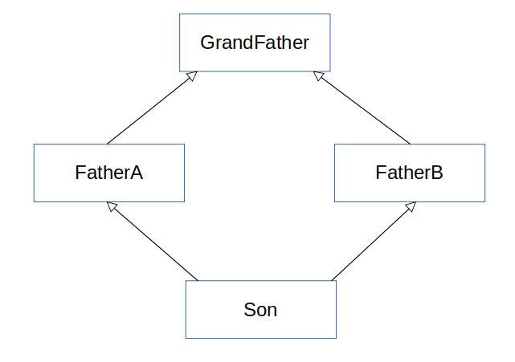
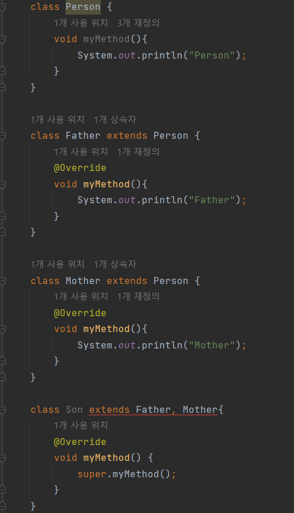

# 2022/12/29

## 왜 자바는 다중상속을 지원하지 않을까?

그 이유는 다중 상속의 다이아몬드 문제 때문

자바에서 다중 상속을 허용한다고 가정한다면, 다이아몬드 형태 모양으로 상속이 가능해지는데

이와 같이  son에서 어떤 myMethod()를 호출해야하는지 알 수가 없으며 컴파일 불가능하다.

결국 자바에서 다중 상속은 득실 관계에서 실이 더많기에 자바와 C#은 다중 상속을 포기헀다.

대신 자바에서는 C++에 없는 인터페이슬르 도입하여 다중 상속의 득은 취하고 실은 버렸다.