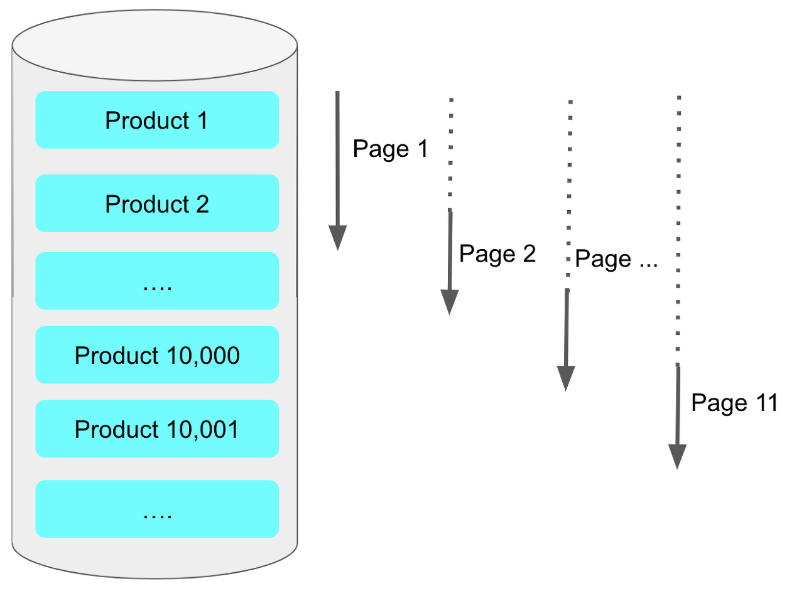

# 2022/12/03

## Offset을 No Offset 으로 구조 변경

>기존의 페이징 방식은 페이지 번호와 페이지 사이즈 기반으로 한다.

- No Offset은 페이지 번호 없이 더보기 방식을 이야기 한다.

###  No Offset가 왜 빠른이유
> 페이징 쿼리가 뒤로갈수록 느린 이유는 결국 앞에서 읽었던 행을 다시 읽어야 하기 때문

페이징 방식이 느린 이유는 앞에 읽었던 내용을 다시 읽어야 하기 때문에 느리다.

> 예로 페이지 번호가 10,000이고 사이즈가 20이면 10,020개의 행을 읽어야 합니다.
그리고 실제 필요한 행은 마지막 20개 이므로 앞의 10000개의 행은 버리게 된다.
그래서 뒤로 갈 수록 쓰지 않아 버려야하지만 읽어야 할 행의 개수가 많아지르모 자연스레 속도가 느려진다.

No Offset 방식은 이 앞에 읽어야하는 부분을 안읽고 조회 시작 부분을 인덱스로 빠르게 찾아 
매번 첫 페이지를 읽도록 만드는 방식이다.

### 단점
- where에 사용되는 기준 Key가 중복이 가능할 경우 
  - group by 등으로 기준을 잡을 key가 중복이 될 경우 정확한 결과를 반환할 수 없다.
- 자사 서비스를 More 버튼이 아니라 페이징 버튼 형식으로 강제 해야할 경우 사용불가능 하다.