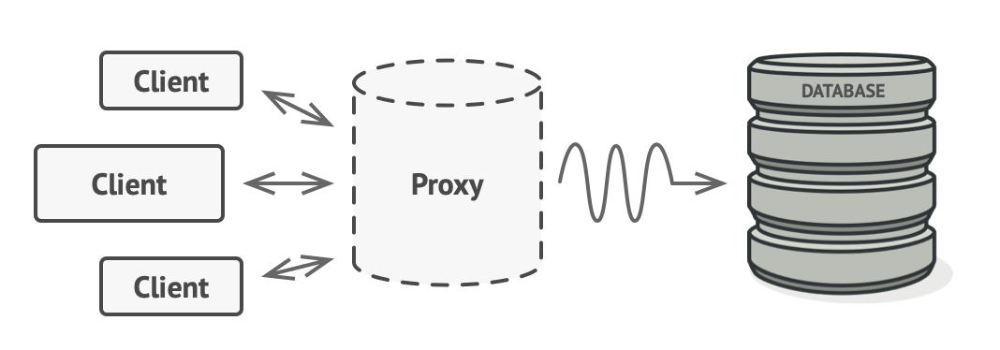

# 2022/12/30

## 프록시 패턴

> 개발 폐쇄 원칙과 의존 역전 원칙이 적용된 설게 패턴
> - 인터페이스를 중간에 두어 구체클래스들에게 영향을 받지 않게 설계
> - 직접 접근하지 않고 Proxy를 통해서 한번 더 우회해서 접근하도록 설계되어있다.

- 프록시는 대리자, 대변인을 뜻하는 단어이며 이는 프로그램에서도 동일하게 적용된다.
- 어떤 객체를 사용할 때 객체를 직접적으로 참조하는 것이 아닌 해당 객체를 대리하는 객체를 통해서 대상 객체에 접근하는 방식. 
  - 이는 해당 객체가 메모리에 존재하지 않아도 기본적인 정보를 참조하거나 설정할 수 있고, 실제 객체의 기능이 필요한 시점까지 객체의 생성을 미룰 수 있음

프록시 패턴의 경우 실제 서비스 객체가 가진 메서드와 같은 이름의 메서드를 사용하는데 이를 위해 인터페이스를 사용한다.

- 실제 서비스와 같은 이름의 메서드를 구현한다. - 인터페이스를 사용
- 실제 서비스에 대한 참조 변수를 갖는다.(합성)
- 실제 서비스의 같은 이름으 가진 메서드를 호출하고 그 값을 클라이언트에게 돌려준다.
- 실제 서비스의 메소드 호출 전후에 별도의 로직을 수핼할 수도 있다.

## 장단점

### 장점
- 전처리 및 후처리 사용에 용이하다. 
  - ( B가 C에게 요청하기 전 다른 작업을 전처리로 가능하다는 점)
- 특정 메서드에 대한 보안이 좋다. 
  - (B가 C에게 요청을 하여 A는 C가 무슨 일이 일어나는지 정확히 알기 힘들다는 점)
### 단점
- 프로시패턴을 사용 시 가독성이 떨어진다. 
  - ( A->B->C라는 구조로 누군가 거쳐가야 한다는 점 이런 경우가 많아지면 가독성이 떨어질 우려)

## 프록시 패턴 다이아그램

