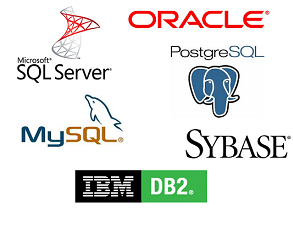
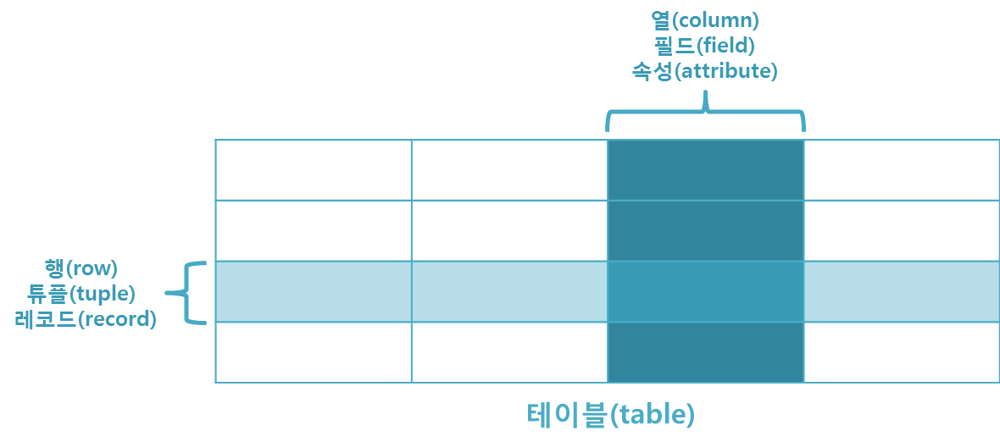

# 2022/12/08

## 관계형 DB(RDBMS)

> 데이터가 하나 이상의 열과 행의 테이블에 저장되어서
> 서로 다른 데이터 구조가 어떻게 관련되어있는지 쉽게 파악하고
> 이해할 수 있도록 사전 정의된 관계로 데이터를 구성하는 정보 모음
> 
> 관계는 이러한 테이블 간의 여러 테이블 간의 논리적 연결

### 테이블

- 테이블은 키와 값의 관계를 나타낸다.
- 테이블은 이름을 가지고 있으며, 행과 열 그리고 거기에 대응하는 값을 가집니다.
- 관계형 데이터베이스는 테이블이 다른 테이블들과 관계를 맺고 모여있는 집합체로 이해할 수 있습니다.

## 관계형 DB의 이점

1. 유연성
   - 전체 데이터베이스 구조를 변경하거나 기존 애플리케이션에 영향을 주지 않고 필요할 때마다 간편하게 테이블, 관계를 추가 또는 삭제하고 데이터를 변경할 수 있습니다.

2. 사용 편의성 
   - SQL을 사용하여 복잡한 쿼리를 쉽게 실행

3. 보안 기능
   - 역할 기반 보안을 통해 특정 사용자로 제한

4. 데이터베이스 정규화
   - 데이터 중복성을 줄이고 데이터 무결성을 개선하는 정규화라는 설계 기법을 사용

5. 공동작업
   - 동시에 데이터를 운영하고 액세스할 수 있다.
   - 잠금 기능으로 업데이트 도중 데이터에 동시 액세스할 수 없다. 

6. ACID 규정 준수
   - 오류, 실패, 기타 잠재적 오작동에 관계없이 데이터 유효성을 검사 가능

### ACID 속성
- **원자성**은 완전한 데이터베이스 트랜잭션을 구성하는 모든 요소를 정의합니다.
- **일관성**은 트랜잭션 후 데이터 포인트를 올바른 상태로 유지하기 위한 규칙을 정의합니다.
- **고립성**은 혼란을 피하기 위해 트랜잭션이 커밋될 때까지 트랜잭션의 효과가 다른 사람에게 보이지 않게 해줍니다.
- **내구성**은 트랜잭션이 커밋되면 데이터 변경 사항이 영구적이 되도록 합니다.