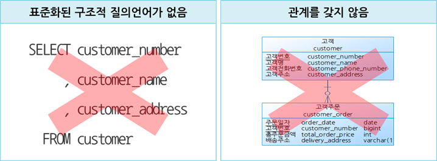
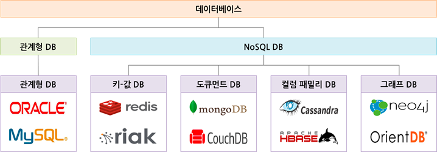
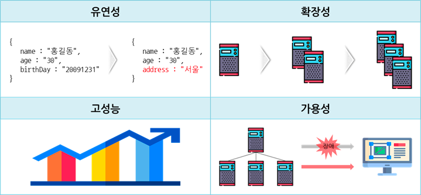

# 2022/12/09

## NoSQL(비관계형 데이터베이스)

NoSQL 데이터베이스가 관계형 데이터베이스 이외의 형식으로 데이터를 저장하는 데이터베이스
> - 표준화된 구조적 질의 언어가 없다.
> - 관계를 가지지 않는다.

## NoSQL의 4가지 유형

1. 문서 데이베이스(Document Database)
   - JSON(JavaScript Object Notation) 객체와 비슷한 문서에 데이터를 저장
     - 필드와 값의 형태로 구성된 데이터를 JSON 포맷으로 관리하는 데이터베이스
2. 키-값 데이터베이스(Key-Value Database)
    - 키와 값으로 구성된 배열구조의 데이터베이스로 NoSQL 데이터베이스 중 가장 단순한 구조
3. 칼럼 패밀리 DB(Column Family Database)
    - 칼럼과 로우로 구성된 데이터베이스로 칼럼은 이름과 값으로 구성되고 로우는 각기 다른 칼럼으로 구성이 가능
4. 그래프 데이터베이스(Graph Database)
    - 데이터를 노드로 표현하고, 노드 사이의 관계를 화살표로 표현하는 데이터베이스

## NoSQL 특징

- 유연성 : 스키마 선언 없이 필드의 추가 및 삭제가 자유로운 Schema-less 구조입니다.
- 확장성 : 스케일 아웃에 의한 서버 확장이 용이합니다.
- 고성능 : 대용량 데이터를 처리하는 성능이 뛰어납니다.
- 가용성 : 여러 대의 백업 서버 구성이 가능하여 장애 발생 시에도 무중단 서비스가 가능합니다.

