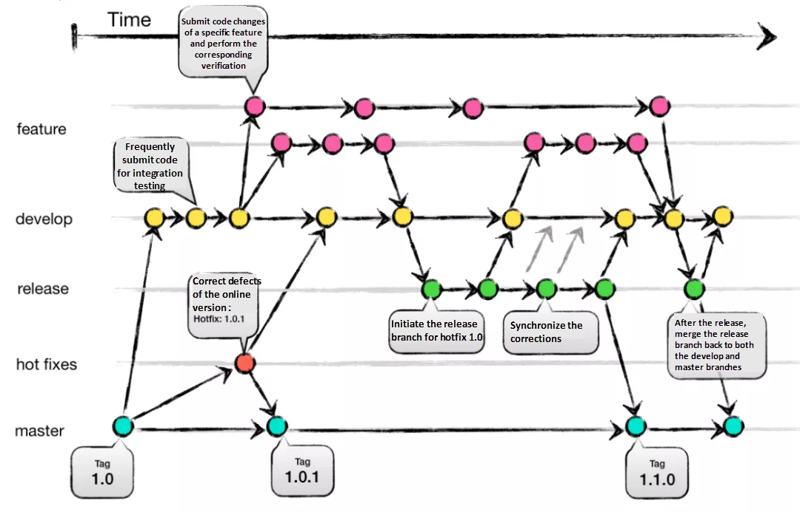
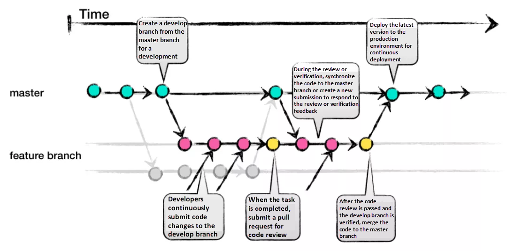

# 2023/01/01

## git flow vs github flow 차이?

## Git Flow

> feature, develop, release, hotfix, master 5가지의 브랜치 전략을 가지고 있다.

feature, develop, release, hotfix, master 5가지의 브랜치 전략을 가지고 있습니다.
기능을 개발하기 위해서 feature 브랜치를 만들고, 브랜치를 이동할 때 check out 명령어를 사용하면 됩니다. feature 브랜치는 개발을 동시가 아닌 별도로 진행하여 충돌을 막습니다.

기능 개발이 모두 끝나면, develop 브랜치에 머지합니다. develop 브랜치는 마치 master 브랜치와 비슷합니다. 왜냐하면 아직 released 되지 않은 최신의 소스코드를 유지하기 때문입니다. 만약에 모든 검증이 끝났다면, develop 브랜치로부터 release 브랜치를 만듭니다.

만약에 release 브랜치에서 문제가 발견되었다면, release 브랜치에서 문제를 해결한 후 develop 브랜치로 머지합니다. release 브랜치 코드가 정상 배포되었다면, 최종 코드는 develop과 master 브랜치로 머지합니다. 이 방법으로 matser 브랜치는 항상 운영 환경의 코드를 유지하고, dvelop 브랜치는 개발 환경의 최신 코드를 유지합니다

Git-Flow는 hotfix 브랜치가 있는데, 실제 운영중인 문제를 빠르게 수정하기 위한 것입니다. 문제가 해결되고 나면, develop 브랜치, 그 다음에 master 브랜치로 머지합니다.

### 장점
- 브랜치별로 책임을 명확히 하는 규칙성
- 매우 디테일하게 버전 정보 제공
- master에 있는 코드는 매우 깔끔한 상태 유지(테스트되고 최종 수정된 것만 반영되기 때문)
- 브랜치별로 역할이 있으므로 문제가 있더라도 문제 발생시 각 브랜치를 대기 시킬 필요가 없음(freeze)

### 단점
- 많은 브랜치 때문에 생기는 복잡한 규칙
- release 로 인한 많은 동기화 작업
- 애자일의 반복적인 접근법과 Git-Flow의 엄격하고 구체적인 규칙과 충돌

## Github Flow

> Git-Flow와 달리, GitHub-Flow는 release 브랜치가 없습니다. 하나의 버전이 만들어졌으면, 배포될 수 있다는 개념

### 장점
- 깔끔하고 간단한 협력 규칙
- 지속적인 통합과 개발의 편리함
- 빠른 피드백과 이슈 발행 및 변화를 독려
- feature 개발 이후 dvelop, release까지 전달할 필요가 없음

### 단점
- Git-Flow에 비해 체계적이지 않음. 자유분방한 코드 관리로
- 전체적인 개발 프로세스 관리가 더 힘들어질 수 있음
- 짧은 주기가 아닌 큰 주기의 release의 환경에는 맞지 않음
- 운영과 개발 브랜치 모두를 감당하는 master 브랜치는 코드가 지저분 할 수 있음
- release 준비와 버그 수정이 모두 master 브랜치에 있으므로 특별한 주의가 더 필요함