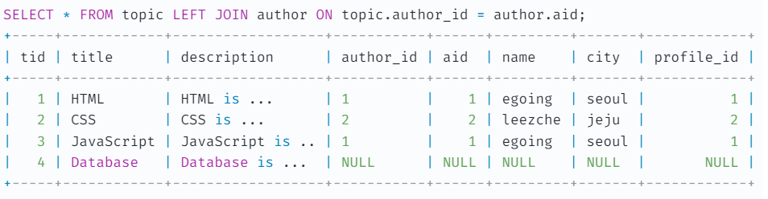

# 2023/01/10

## left join, inner join, right join 차이

### OUTER JOIN - 합집합
- LEFT JOIN은 OUTER JOIN의 일종
  - 따라서 LEFT OUTER JOIN이라고 볼 수 있다.
- OUTER JOIN은 합집합을 의미

LEFT JOIN은 왼쪽의 모든 행을 조회한다.
topic테이블의 author_id 필드의 값이 NULL이면, author 테이블은 해당 행이 존재하지 않으므로 해당 행의 필드 값들은 NULL로 채운다.

### INNER JOIN - 교집합

교집함을 의미하며 겹치지 않는 행이 존재할 경우 그 행은 결과에서 제외된다.

=======
# 2023/01/11

>GROUP BY 는 원하는 데이터들 끼리 묶어서 처리하고 싶을 때 사용
> 
>HAVING은 그룹에 대해 조건에 맞는 데이터만 뽑아 사용할 때 사용

## HAVING 과 WHERE의 차이

- WHERE는 그룹화 또는 집계가 발생하기 전에 레코드를 필터링하는 데 사용되지만 HAVING 은 그룹화 또는 집계가 발생한 후 레코드를 필터링하는 데 사용된다는 것이다.

- GROUP BY는 쉽게 ~~별로 묶고 싶을 때 사용한다고 생각하면 편하다.
  - ex) 성 별로, 직함 별로, 나이대 별로 등
>>>>>>> origin/main
