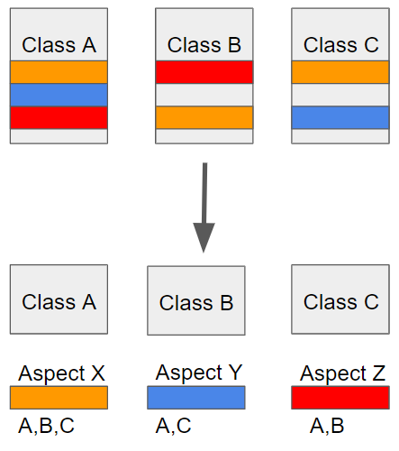

# 2023/01/14

## AOP(관점 지향 프로그래밍)
어떤 로직을 기준으로 핵심적인 관점, 부가적인 관점으로 나누어서 보고 그 관점을 기준으로 각각 모듈화한다. 
- 모듈화란 어떤 공통된 로직이나 기능을 하나의 단위로 묶는 것을 말한다.

> 흩어진 관심사를 Aspect로 모듈화하고 핵심적인 비즈니스 로직에서 분리하여 재사용하겠다는 것이 AOP의 취지

## 스프링 AOP 특징

- 프록시 패턴 기반의 AOP 구현체
  - 프록시 객체를 쓰는 이유는 접근 제어 및 부가기능을 추가하기 위해서임
- 스프링 빈에만 AOP를 적용 가능
모든 AOP 기능을 제공하는 것이 아닌 스프링 IoC와 연동하여 엔터프라이즈 애플리케이션에서 가장 흔한 문제(중복코드, 프록시 클래스 작성의 번거로움, 객체들 간 관계 복잡도 증가 ...)에 대한 해결책을 지원하는 것이 목적

### AOP의 장점
- 어플리케이션 전체에 흩어진 공통기능이 하나의 장소에서 관리됨
- 다른 Service 모듈들이 본인의 목적에만 충실하고 그 외 사항들은 신경 쓰지 않아도 됨

### AOP 어노테이션
1. @Component
   - 컴포넌트 어노테이션을 명시해 스프링 컨테이너가 객체 생성하도록 한다.

2. @Aspect
   - 스프링 컨테이너에 AOP 담당 객체임을 알린다.

3. @Around
   - 횡단 관심사항의 대상 지정과 적용 시점을 지정한다. (pointcut, advice)