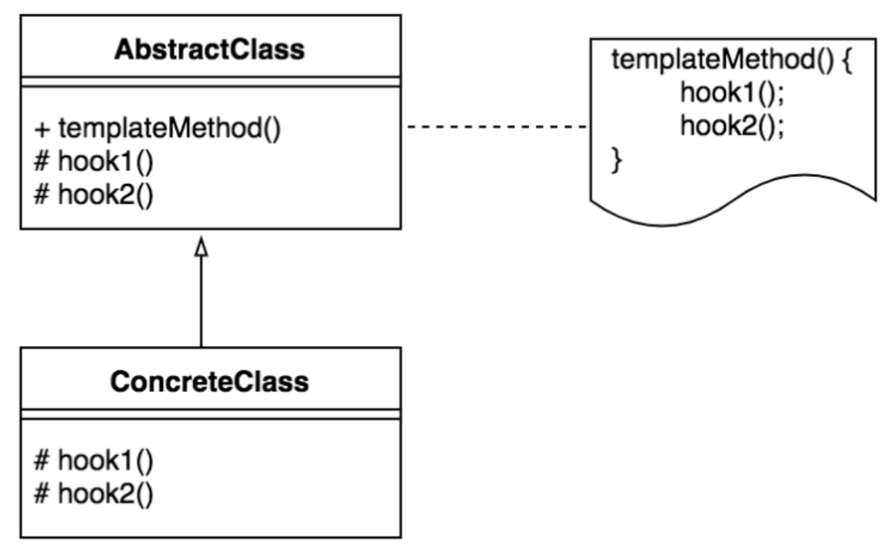
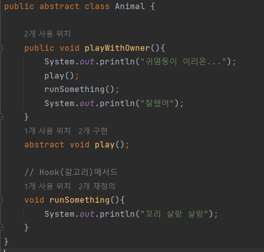
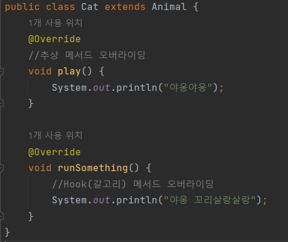
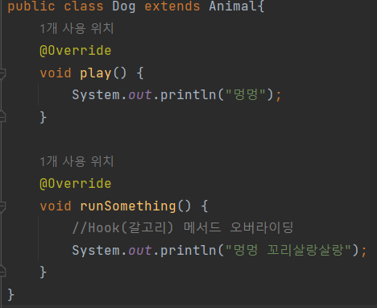
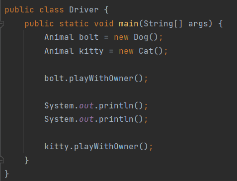

# 2023/01/02

## 템플릿 메서드 패턴

> 상위 클래스의 견본 메서드에서 하위 클래스가 오버라이딩한 메서드를 호출하는 패턴

클래스 다이어그램을 보면 템플릿 메서드 패턴은 의존 역전 원칙을 활용했다.

코드의 중복을 없애기 위한 패턴 중 하나가 템플릿 메서드 패턴

AbstractClass (추상 클래스) 는 템플릿을 제공하고 이를 상속 받는 하위 클래스가 구체적인 로직을 작성

추상 클래스가 전체적인 골격을 정의하고 일부 로직은 하위 상속 클래스에서 구현합니다.

중복된 로직은 추상 클래스에 정의하고 달라지는 비즈니스 로직만 상속 클래스에서 재정의 (오버라이딩) 합니다.

여기서 중복된 로직은 일반적으로 "변하지 않는 부분" 이고 비즈니스 로직은 "변하는 부분" 이라고 할 수 있습니다.

## 템플릿 메소드 패턴 장단점
### 장점
1. 중복코드를 줄일 수 있다.

2. 자식 클래스의 역할을 줄여 핵심 로직의 관리가 용이하다.

3. 좀더 코드를 객체지향적으로 구성할 수 있다.

### 단점
1. 추상 메소드가 많아지면서 클래스 관리가 복잡해진다.

2. 클래스간의 관계와 코드가 꼬여버릴 염려가 있다.

## 예제

