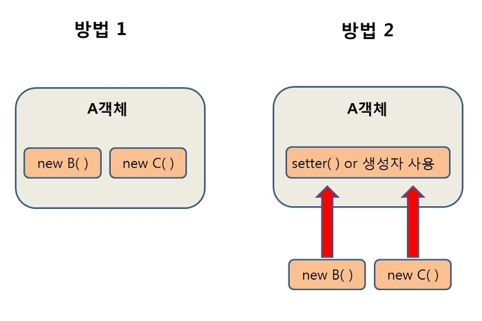

## 2023/01/25

명절 연휴 다끝나고 오랫만에 쓰는 TIL

# IoC/DI 제어의 역전/의존성 주입

## DI(Dependency Injection)
> 스프링이 제공하는 의존 관계 주입 기능으로, 객체를 직접 생성하는 게 아니라 외부에서 생성한 후 주입 시켜주는 방식
> 
> 모듈 간의 결합도가 낮아지고 유연성이 높아진다.

2번째의 방법과 같이 객체가 생성자를 통해 직접적으로 객체를 생성하는 것이 아니라 외부에서 생성된 객체를 사용하는 방법

## Ioc(Inversion of Control)
> 메소드나 객체의 호출작업을 개발자가 결정하는 것이 아니라, 외부에서 결정되는 것을 의미

### 장점
- 객체의 의존성을 역전시켜 객체 간의 결합도를 줄이고 유연한 코드를 작성할 수 있한다.
  - 가독성 및 코드 중복, 유지 보수 용이

스프링이 모든 의존성 객체를 스프링이 실행될때 다 만들어주고 필요한곳에 주입 시켜 줌으로써 Bean들은 싱글턴 패턴의 특징을 가지며,
제어의 흐름을 사용자가 컨트롤 하는 것이 아니라 스프링에게 맡겨 작업을 처리