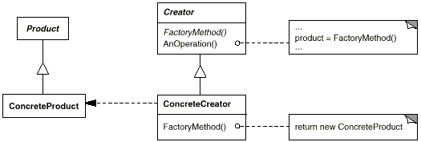

# 2023/01/03

## 팩토리 메서드 패턴

> 객체 지향에서 팩토리는 객체를 생성한다.
> 
> 팩토리 메서드는 객체를 생성 반환하는 메서드를 말하며 여기에 패턴이 붙으면 하위 클래스에서 팩터리 메서드를 오버라이딩해서 
> 객체를 반환하는 것을 의미

- 객체 생성을 캡슐화하는 패턴
- creator의 서브 클래스에 팩토리 메소드를 정의하여 팩토리 메소드 호출로 적절한 ConcreteProduct 인스턴스를 반환하게 한다.

### 팩토리 메소드 패턴 사용 이유

- 클래스의 생성과 사요의 처리로직을 분리하여 결합도를 낮추기 위해서
  - 결합도는 클래스의 처리 로직에 대한 변경점이 생겼을 때 얼마나 영향을 주는지에 따라 높고 낮다로 나뉜다.
  - 팩토리 메소드 패턴을 사용할 경우 직접 객체를 생성해 사용하는 것을 방지하고 서브 클래스에 생성 로직을 위임함
    - 효율적인 코드 제어가 가능하고 의존성을 제거

"오버라이드된 메서드가 객체를 반환하는 패턴"

팩터리 메서드 패턴도 의존 역전 원칙을 활용하고있다.
