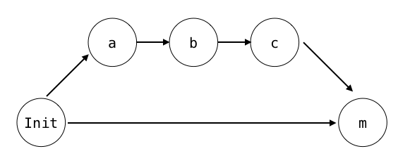
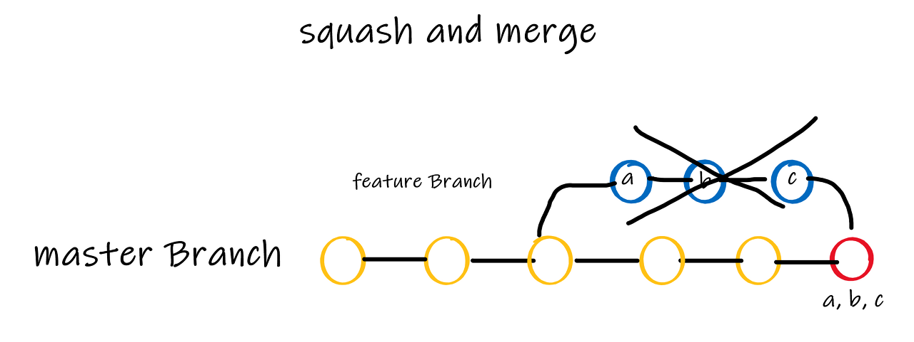
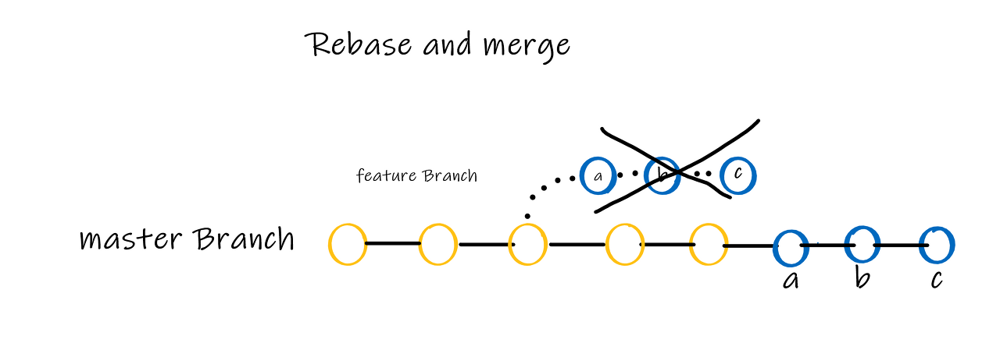

# 2023/01/04

## Git merge 전략 (squash and merge, rebase and merge)
**merger의 3가지 종류**

- merge
- squash and merge
- rebase and merge 

## merge
>가장 기본적인 방법이며 merger가 어느 시점에 진행했는지 쉽게 알 수 있다.

#
## Squash and Merge
>여러개의 Commit을 하나의 Commit으로 만들어서 merge하는 방식

#
## Rebase and Merge
>commit a, b, c 의 관계를 그대로 유지한 채, 메인 브렌치에 그대로 추가

- 브랜치 병합 시 merge commit 기록이 남지만 rebase and merge는 하나의 브랜치에서 작업한 것처럼 보여진다.

- 어느 시점에 master branch로 merge되는지 알기 어려울 수 있기에 태그를 달아줘서 구분을 지어주는게 좋다.