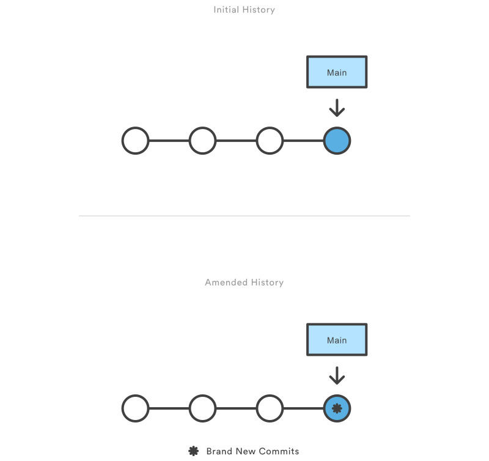

# 2023/01/05

## 

## Git을 쓰면서 주의해야 했던 점이 있다면?
   
Conplict : 파일을 병합 (Merge, Rebase)하는 과정에서 발생하는 문제

## 방금 commit한 내용을 수정하려면 어떻게 해야할까?

- git commit --amend으로 마지막 커밋한 내용을 수정한다.
  - 다만 마지막 커밋의 내용만 수정된 것이 아니라 아예 새로운 커밋을 만들기 때문에 커밋의 해쉬코드 또한 다르다.

## commitA -> commitB -> commitC 후에 commitA로 되돌리려면 어떻게 해야할까?
- git reset 을 통해서 이전 commit으로 돌아갈 수 있다.

### N번째 뒤의 commit으로 가기
EX) 하나 뒤의 커밋으로 돌아가라

- git reset HEAD~1

이 처럼 1은 하나뒤에 있는 것을 의미하며 두 개 뒤에 있는 커밋으로 가고 싶다면 git reset HEAD~2로 작성 하면 될것이다.
특정 commit으로 가는법

**git reset (commitA의 해쉬값)**
- 파일은 건드리지 않고 커밋만 취소
  - git reset --soft

- 파일까지 이전 버전으로 되돌린다.
  - git reset --hard

## 작업한 내용을 커밋하지 않고, 임시 저장하는 방법은 무엇일까?
- git stash 를 이용하여 내용을 임시 저장

