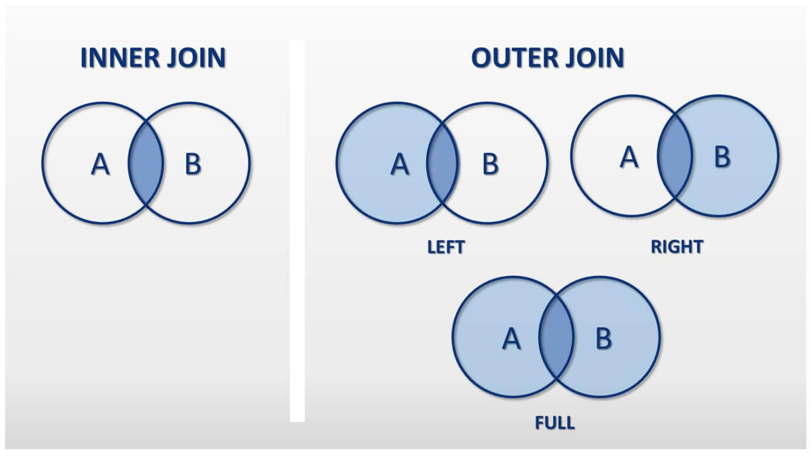
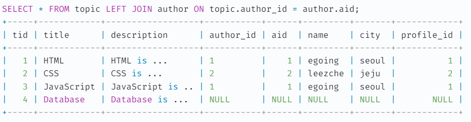

# 2023/01/10

## left join, inner join, right join 차이

### OUTER JOIN - 합집합
- LEFT JOIN은 OUTER JOIN의 일종
  - 따라서 LEFT OUTER JOIN이라고 볼 수 있다.
- OUTER JOIN은 합집합을 의미

LEFT JOIN은 왼쪽의 모든 행을 조회한다.
topic테이블의 author_id 필드의 값이 NULL이면, author 테이블은 해당 행이 존재하지 않으므로 해당 행의 필드 값들은 NULL로 채운다.

### INNER JOIN - 교집합

교집함을 의미하며 겹치지 않는 행이 존재할 경우 그 행은 결과에서 제외된다.

