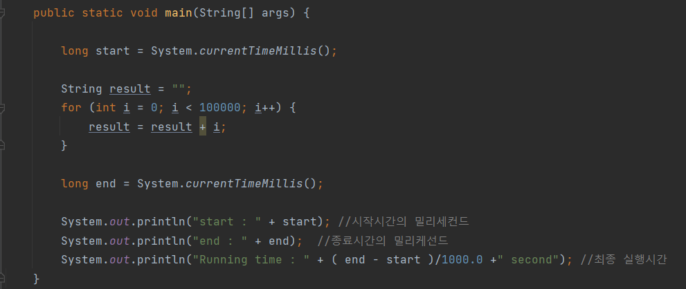
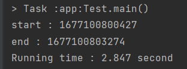
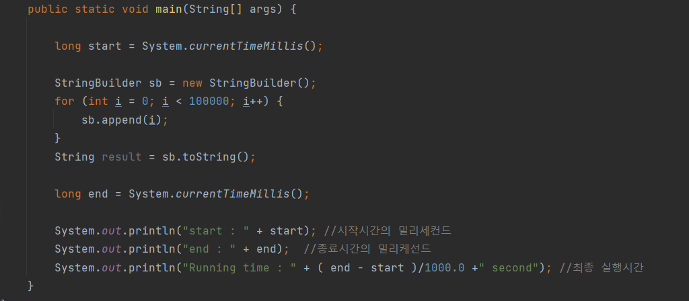
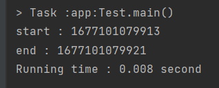

# 컴파일러 최적화가 없다는 가정 하에, Loop문 내에서 String + 를 하는 로직이 왜 나쁜가?

## String은 불변하다

Loop문 내에서 String을 연산하는 것은 성능상 문제가 발생할 수 있다.
- String이 **불변(immutable)** 자료형이기 때문

>String은 변경 불가능한 문자열 자료형으로, 문자열을 수정하면 새로운 String 객체를 생성한다.

따라서, Loop문 내에서 String을 더할 때마다 새로운 String 객체가 생성

### 문제점
- 이전에 생성된 String 객체는 가비지 컬렉터에 의해 메모리에서 해제되어 프로그램의 실행 속도를 저하시키고, 메모리 사용량을 증가시키는 원인이 됩니다.

그렇다면 Loop문 내에서 String을 연산하지 않고 어떻게 해야하는가?

>**StringBuilder**를 사용하는 것이 좋다.
StringBuilder는 **가변(mutable)** 자료형으로, 문자열을 수정할 때 새로운 객체를 생성하지 않고 내부 버퍼를 수정하여 프로그램의 실행 속도를 향상시키고, 메모리 사용량을 감소시키는 효과를 가져옵니다.

## EX

### String을 연산할 떄

#

#

#
### StringBuilder로 연산할 때

#

이와 같이 확연한 차이를 볼 수 있다.
