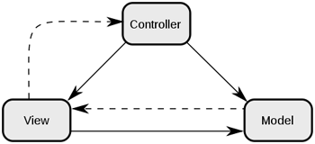
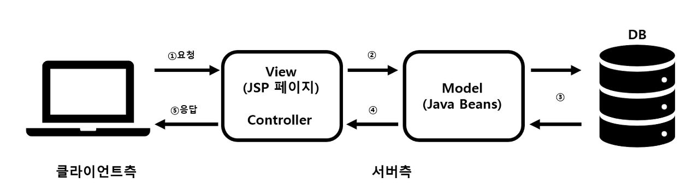
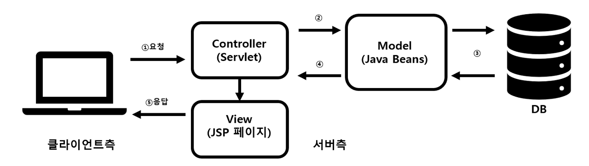

# 2022/12/05

## MVC 패턴

> Model, View, Controller의 약자
> 
>  Controller를 조작하면 Controller는 Model을 통해 데이터를 가져오고 그 데이터를 바탕으로 View를 통해 시각적 표현을 제어하여 사용자에게 전달

## MVC 모델1과 모델2

### MVC 모델1

>controller 영역에 View 영역을 같이 구현하는 방식이며, 사용자의 요청을 JSP가 전부 처리하며
>요청을 받은 JSP는 JavaBean Service Class를 사용하여 웹브라우저 사용자가 요청한 작업을 처리하고 그 결과를 출력

### MVC 모델2

>모델 1에서 유지보수가 힘들다는 단점을 보완하기 위해 나온 모델이며 
> 기존에 뷰와 컨트롤러의 역할을 모두 수행하던 JSP는 뷰의 역할만 하게 하고, 대신 컨트롤러 역할을 Servlet이 수행한다.

